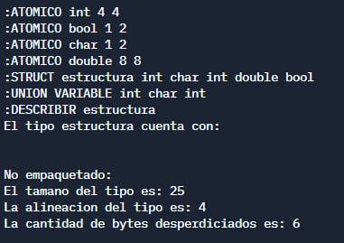
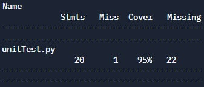

# Manejador de tipos de Datos
### Pregunta 5
Este manejador de tipos de datos trabaja con tipos atómicos, registros (struct) y registros variantes (union). Se pueden crear datos atómicos al colocar la palabra ATOMICO seguida del nombre del tipo, el tamaño de su representación y la alineación que tiene.

    ATOMICO <nombre> <representación> <alineación>

 También se pueden crear tipos struct con la palabra STRUCT seguido del nombre del tipo y de los tipos que se encuentran adentro del struct.
 
    STRUCT <nombre> [<tipo>]

Un ejemplo de la creación de un tipo STRUCT llamado s es:

    STRUCT s int float double
    
##### NOTA: Para utilizar cualquier tipo atómico dentro de un tipo de registro, debe definirse previamente.
La creación del tipo union se realiza con la palabra UNION seguida por el nombre del tipo y los tipos que puede tomar.

    UNION <nombre> [<tipo>]
    
 Un ejemplo de la creación del tipo UNION es:
 
    UNION estructura int string double long

También se pueden describir los tipos, por lo que se conocerá su tamaño, alineación y cantidad de bytes desperdiciados para la creación del tipo.

    DESCRIBIR <nombre>
    
En el caso de los STRUCTS se considera también los registros sin empaquetar, empaquetados y para una versión optimizada que mejora el espacio de los registros sin empaquetar.
Para salir del programa se debe colocar la palabra SALIR únicamente

    SALIR

## Unit Test
Los unit test fueron realizados con el archivo unitTest.py y se pasaron todos los test, obteniendo un 95% de code coverage con la herramienta Coverage.py https://coverage.readthedocs.io/en/6.4.1/

